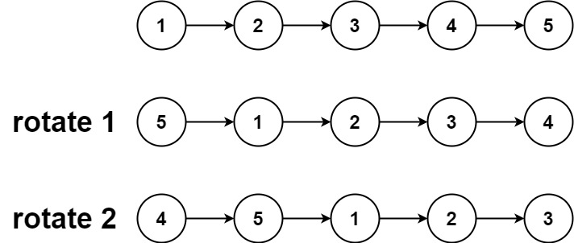

### Linked List
- [X] [Adding two numbers](https://leetcode.com/problems/add-two-numbers/description/)
- [X] [Odd Even Linked List](https://leetcode.com/problems/odd-even-linked-list/description/)
- [X] [Sort 0's, 1's, 2's Linked List](https://takeuforward.org/plus/dsa/linked-list/logic-building/sort-a-ll-of-0's-1's-and-2's)
- [X] [19. Remove Nth Node From End of List](https://leetcode.com/problems/remove-nth-node-from-end-of-list/)
- [X] [206. Reverse Linked List](https://leetcode.com/problems/reverse-linked-list/)
- [X] [Add One to LinkedList number](https://takeuforward.org/plus/dsa/linked-list/faqs--medium/add-one-to-a-number-represented-by-ll)
- [X] [876. Middle of the Linked List](https://leetcode.com/problems/middle-of-the-linked-list/description/)
- [X] [Delete the Middle Node of a Linked List](https://leetcode.com/problems/delete-the-middle-node-of-a-linked-list/description/)
- [X] [Palindrome Linked List](https://leetcode.com/problems/palindrome-linked-list/description/)
- [X] [Intersection of Two Linked Lists](https://leetcode.com/problems/intersection-of-two-linked-lists/description/)
- [X] [Linked List Cycle](https://leetcode.com/problems/linked-list-cycle/description/)
- [X] [Linked List Loop Starting Point](https://leetcode.com/problems/linked-list-cycle-ii/description/)
- [X] [Length of loop in LL](https://takeuforward.org/plus/dsa/linked-list/faqs--medium/length-of-loop-in-ll)
- [X] [Reverse LL in group of given size K](https://leetcode.com/problems/reverse-nodes-in-k-group/description/)
- [X] [Rotate List](https://leetcode.com/problems/rotate-list/description/)

### Problems

---

#####  02 - Adding two numbers

---
#####  Reverse LL in group of given size K

---
##### Rotate Linked List by k positions
